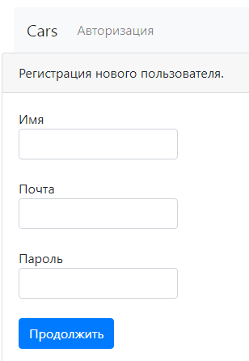
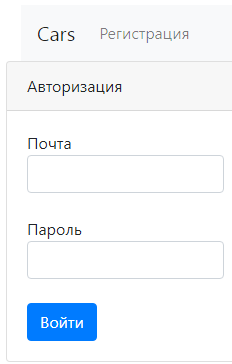
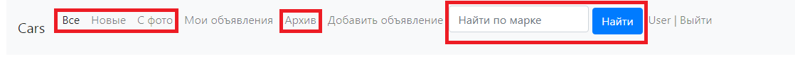
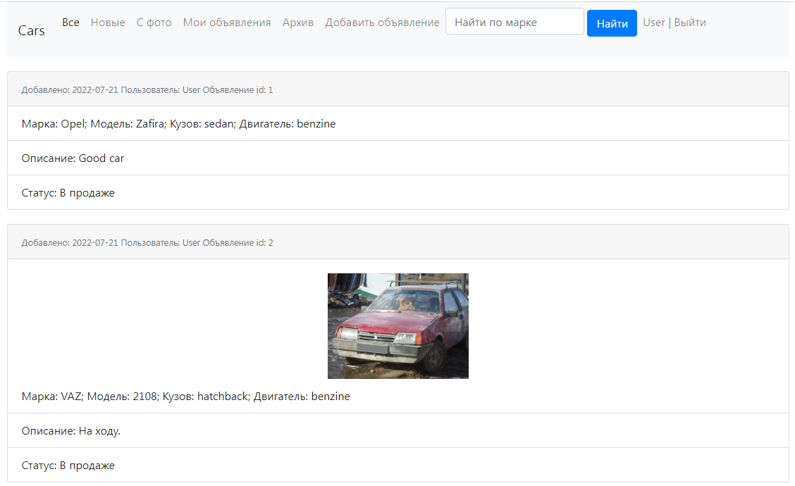
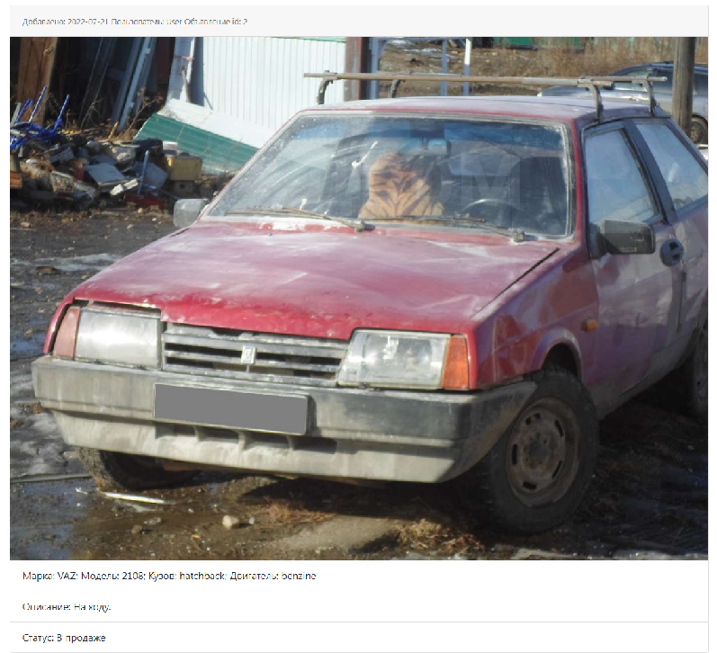
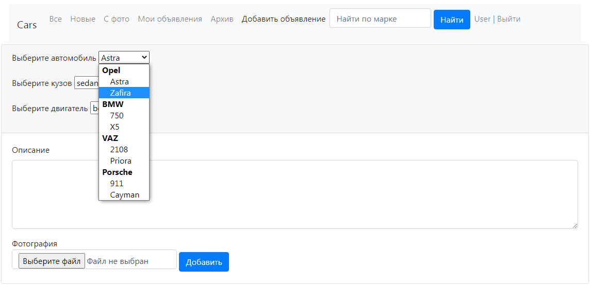
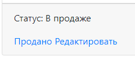

# Cars

Приложение по размещению объявлений для продажи автомобилей.
- Стек технологий:
    * Spring boot
    * Hibernate
    * PostgreSQL
    * Liquibase
    * Bootstrap
    * Thymeleaf

### Интерфейс приложения:

1. Окно регистрации и входа в приложение.

2. Панель навигации. Включает в себя различные фильтры объявлений, 
мои объявления и добавление объявления. Остановимся по подробнее на фильтрах.
Вкладки "Все", "Новые", "С фото", фильтруют объявления в соответсвии со своими названиями.
Строка поиска ищет по марке автомобиля. При этом показываются только объявления в продаже.
Вкладка "Мои объявления" показывает все объявления пользователя.
Вкладка "Архив" показывает все проданные автомобили всех пользователей.

3. Если объявление имеет фотографию, то по ней можно кликнуть и откроется 
страница с данным объявлением и увеличенная фотография.

4. Вкладка "Добавить объявление" добавляет новое объявление.

5. Во вкладке "Мои объявления" у пользователя появляются дополнительные 
опции по управлению своими объявлениями. Объявление можно пометить как "Продано"
и тогда статус объявления изменится и появится дата закрытия объявления.
Также можно редактировать объявление, окно редактированиия выглядит аналогично
окну добавления.

